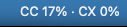
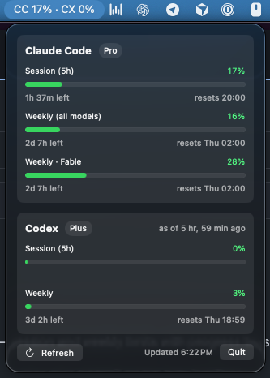

# LLMUsageBar

macOS menu bar app showing your Claude Code and Codex rate-limit usage at a glance.

**Menu bar:** `CC 12% ▸3 · CX 42%` — current session usage for each tool, plus a bold `▸N` count of actively working sessions (hidden when none are working).



**Click it:** full details — session and weekly limits with progress bars, time until reset, per-model buckets, and your plan. Each running instance is listed with its working directory and whether it's working or waiting for input; click a row to jump to its terminal (exact tmux pane / iTerm2 or Terminal.app tab, app-level focus elsewhere).



## How it gets the data

- **Claude Code** — calls Anthropic's OAuth usage endpoint (the same numbers `/usage` shows) using the credential Claude Code already keeps in your macOS Keychain. Read-only: it never modifies or refreshes the token. If the token expires, just open Claude Code — it refreshes itself.
- **Codex** — reads the `rate_limits` snapshots the Codex CLI writes into `~/.codex/sessions/`. Fully local. The number is as fresh as your last Codex request; if the snapshot is stale the card says "as of N ago", and expired windows show as 0%.

Codex data refreshes every 60 seconds; the Claude usage API is polled every 5 minutes (with exponential backoff on 429s).

> **Disclaimer:** This is an unofficial tool, not affiliated with Anthropic or OpenAI. It relies on undocumented endpoints and local file formats that may change or break at any time.

## Install

Download `LLMUsageBar-<version>.zip` from the [latest release](https://github.com/theanht1/llm_usage_bar/releases/latest), unzip it, and move `LLMUsageBar.app` to `/Applications`.

The app is ad-hoc signed (not notarized), so macOS quarantines the download and will refuse to open it at first. Clear the quarantine flag and launch:

```sh
xattr -d com.apple.quarantine /Applications/LLMUsageBar.app
open /Applications/LLMUsageBar.app
```

Alternatively: try to open the app once, then approve it under System Settings → Privacy & Security → "Open Anyway".

**Launch at login:** System Settings → General → Login Items → add LLMUsageBar.

## Build from source

Requires macOS 14+ and the Xcode Command Line Tools (Swift 5.10+).

```sh
./build.sh          # builds dist/LLMUsageBar.app
open dist/LLMUsageBar.app
```

Install permanently:

```sh
cp -R dist/LLMUsageBar.app /Applications/
```

## Verify without the UI

```sh
dist/LLMUsageBar.app/Contents/MacOS/LLMUsageBar --check
```

prints what the UI would show and exits:

```
Claude Code (plan: pro)
  Running: 2
    working  /Users/you/projects/app  (pid 8380, tty ttys049)
    waiting  /Users/you/projects/web  (pid 54116, tty ttys047)
  Session (5h): 12% 1h 14m left
  Weekly (all models): 5% 6d 7h left
  Weekly · Fable: 9% 6d 7h left
Codex (plan: plus)
  Running: 1
    waiting  /Users/you/projects/app  (pid 28055, tty ttys071)
  Session (5h): 42% 2h 3m left
  Weekly: 54% 3d 1h left
```

`--focus <pid>` runs the same click-to-focus action the panel rows use and prints each step.

## Layout

- `Sources/LLMUsageBar/ClaudeProvider.swift` — Keychain read (via `/usr/bin/security`) + OAuth usage API
- `Sources/LLMUsageBar/CodexProvider.swift` — session-log parsing
- `Sources/LLMUsageBar/UsageStore.swift` — 60 s refresh loop, menu bar title
- `Sources/LLMUsageBar/DetailsView.swift` — click-open panel
- `Sources/LLMUsageBar/InstanceCounter.swift` — running-session scan (`ps` + `lsof`, working/waiting heuristic)
- `Sources/LLMUsageBar/SessionFocuser.swift` — click-to-focus (tmux pane / iTerm2 & Terminal.app tab / app activation)
- `scripts/make_icon.swift` — regenerates `Resources/AppIcon.icns` (`swift scripts/make_icon.swift`)
- `scripts/release.sh` — builds, tags, and publishes a GitHub release (`scripts/release.sh 1.1.0`; needs a clean tree and the `gh` CLI)
- `docs/superpowers/specs/2026-07-02-usagebar-design.md` — design doc

## License

[MIT](LICENSE)
